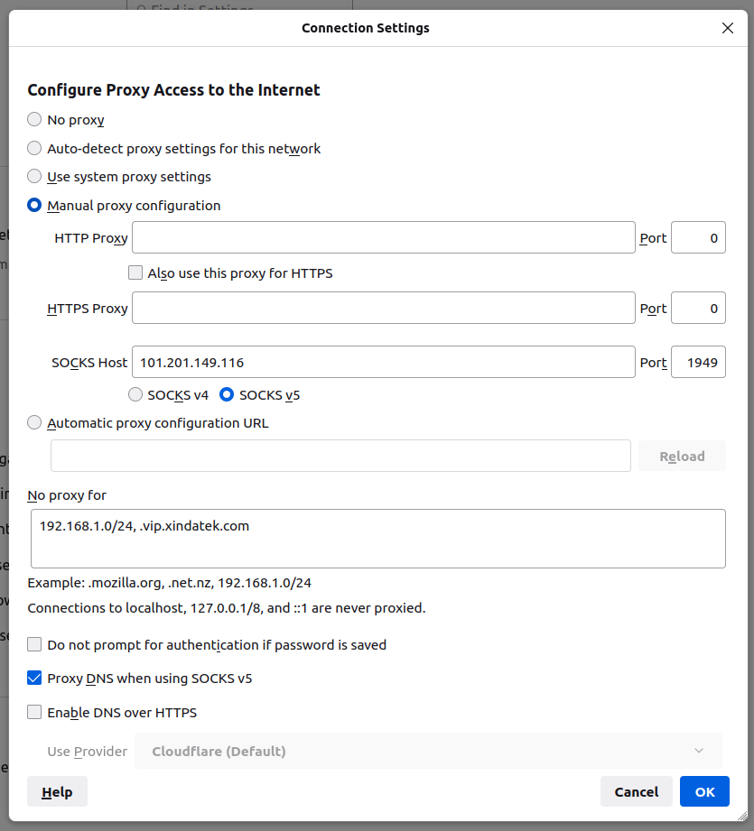

# 科学上网 Socks5 代理

访问境外网络资源时，可使用该代理：

- IP：`101.201.149.116`
- 端口：`1949`

由于国内 DNS 请求受干扰较多，注意设置将 DNS 请求也经过代理转发。

以火狐浏览器为例：

## 访问国内网络的降速问题

为了避免被封，该代理使用了国外的 CDN 来中转流量，响应速度并不快，带宽也不高。

通过该代理访问境内网络，因为路由绕远，体验会更差。所以不建议全局启用代理，可配置代理规则，操作系统的代理配置一般支持 PAC 文件来指定哪些流量走代理服务，主流浏览器也有插件支持。
